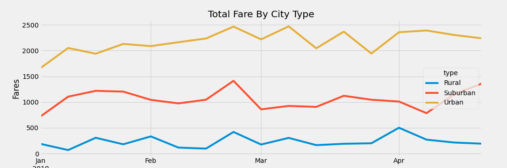

# Challenge_5

### Analysis

- This analysis is being conducted to determine what improvements can be made to our ride sharing buisness.

### Results

-The following chart shows an overhead view of the ridesharing revenue:

-There is a clear correlation between relative population density and revenue from ride sharing, with urban areas generating the bulk of the revenue, and rural areas generating the least. Aside from this, there appears to be very little variation over the analysed 4 month period.

### Recommendations

#### I have 3 recommendations for addressing the disparities between urban, suburban, and rural routes.

1) Rural routes tend to have the greatest revenue per trip taken. More trips may result in rural and suburban areas if the fare is scaled to the distance invovled, with greater distances having a lower per-mile cost.

2) Incentives programs for urban drivers to move their service area to suburban or rural areas will be effective, as there are approximately 30% more drivers in urban areas than actual rides for the timeframe analyzed. This represented idle resources in the form of drivers that are willing, but unable to drive someone.

3) A New Years Eve/Day incentive program guised as a responsible drinking campaign will help to boost revenure for the first week of the year, which has a notable lag in urban and suburban areas as compared to the rest of the sample time period.